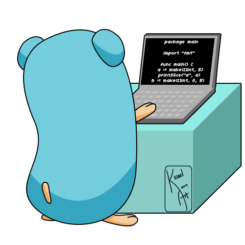

<h2 align="left">Hi 👋! My name is Alex, and I'm a software engineer from Finland</h2>

###

  
  

###

###

  
  
  
  
  
  
  
  
  
  
  
  
  
  
  
  
  
  
  
  
  
  
  
  
  
  
  
  
  
  
  
  
  
  
  
  
  
  
  
  
  
  
  
  
  
  
  
  
  
  
  
  
  

###

###

 

###
