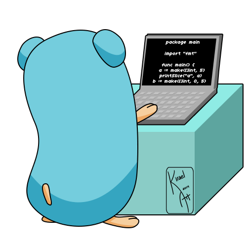

<h2 align="left">Hi 👋! My name is Alex, and I'm a software engineer</h2>

###

  I love learning and building things — from APIs and dev tools to cloud and IoT services. 
  Day to day I work with Go, .NET/C#, and a healthy dose of DevOps/SRE. 
  Always happy to chat, review ideas, or accept a good PR 🙂

###

  
  

  

###

**Tech stack**

  
  
  
  
  
  
  
  
  
  
  
  
  
  
  
  
  
  
  
  
  
  
  
  
  
  
  
  
  
  
  
  
  
  
  
  
  

###

 

###
